# 와보랑께 구현 구조

```mermaid
flowchart LR
  U["사용자 자연어 문장"] --> M["Android/iOS Expo 앱"]
  M --> A["POST /api/analyze"]
  A --> O["로컬 Ollama"]
  O --> P["구조화된 여행 조건"]
  O -. "실패 시" .-> F["기본 한국어 규칙 분석"]
  F --> P
  P --> R["POST /api/recommend"]
  R --> T["한국관광공사 TourAPI"]
  T --> N["실제 장소 후보 정규화"]
  T -. "키 없음·실패" .-> D["시연 코스"]
  N --> L["Ollama 후보 ID 일정 구성"]
  L --> V["식사·중복·시간 검증"]
  L -. "실패·규칙 위반" .-> B["결정적 시간 규칙 일정"]
  B --> V
  V --> G["선택 역·터미널 좌표 해석"]
  G --> Q["TMAP Transit 구간 길찾기"]
  Q -. "키 없음·구간 실패" .-> X["좌표 추정 구간"]
  Q --> S["실제 이동시간 반영·점수 계산"]
  X --> S
  D --> S
  S --> E["POST /api/explain"]
  E --> O
  S --> M
  O --> M
```

## 책임 분리

- 모바일 앱은 `EXPO_PUBLIC_API_BASE_URL`만 알고 외부 API 키를 보관하지 않습니다.
- Express 서버가 TourAPI·TMAP 키, 데이터 캐시, 오류 처리를 담당합니다.
- Ollama는 문장 해석, 실제 후보 ID의 방문 순서 제안, 추천 이유를 담당합니다.
- 서버는 LLM이 제안한 ID가 실제 후보인지 확인하고 출발 거점, 식사 시간, 식사 후 카페, 연속 음식점·카페, 중복 장소, 선택 시간 충족을 결정적으로 검증합니다.
- 2~8시간 선택은 최대 30분 오차만 허용하며, 부족한 시간은 주변 관광 후보 보충과 종류별 체류시간 상한 안의 여유 관람으로 채웁니다.
- LLM 결과가 없거나 검증에 실패하면 같은 후보를 시간 규칙으로 구성하므로 핵심 추천은 계속 동작합니다.
- 적합도 점수와 검증 결과는 동일 입력에서 재현 가능하도록 프로그램 코드로 계산합니다.

## 데이터 소스 상태

| 데이터 | 현재 상태 | 담당 파일 |
|---|---|---|
| 관광지명·주소·좌표 | TourAPI 연결 완료 | `server/src/modules/recommendation/data/tour-api.ts` |
| 자연어 조건 분석 | Ollama + 규칙 폴백 | `server/src/modules/analysis` |
| 코스 순서·식사 시간 | Ollama + 서버 검증 + 규칙 폴백 | `server/src/modules/recommendation/planner.ts` |
| 추천 이유 | Ollama + 계산 설명 폴백 | `server/src/modules/explanation` |
| 출발 역·터미널 좌표 | Nominatim 검색 + 7일 캐시 + 고정 좌표 설정 지원 | `server/src/modules/recommendation/data/geocoder.ts` |
| 코스 거리·시간·경로선 | TMAP Transit 연결, 미설정/실패 구간만 좌표 추정 | `server/src/modules/recommendation/routing.ts` |
| 물품보관함·공공자전거 | 외부 API 조회 + 시연 표기 폴백 | `server/src/modules/recommendation/data/conveniences.ts` |
| 버스정류장 접근성 | TAGO 좌표 기반 근접 정류소 | `server/src/modules/recommendation/data/bus-stops.ts` |
| 지도 | Leaflet + OpenStreetMap, 네이티브 WebView | `src/components/CourseMap*` |

## 다음 데이터 제공처를 추가하는 방법

1. `server/src/modules/recommendation/data`에 제공처별 파일을 만듭니다.
2. 제공처 응답을 앱 내부 타입으로 정규화합니다.
3. API 키는 `.env`에서만 읽습니다.
4. `server/index.ts` 또는 추천 서비스에서 데이터를 합칩니다.
5. 앱은 외부 제공처가 아니라 우리 서버만 호출합니다.
