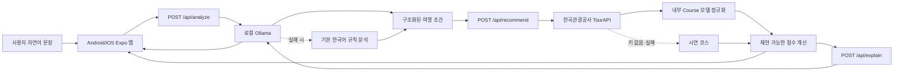

# 와보랑께 구현 구조

## 책임 분리

- 모바일 앱은 `EXPO_PUBLIC_API_BASE_URL`만 알고 외부 API 키를 보관하지 않습니다.
- Express 서버가 TourAPI 키, 데이터 캐시, 오류 처리를 담당합니다.
- Ollama는 문장 해석과 추천 이유만 생성합니다.
- 관광지 선택과 적합도 점수는 동일 입력에서 동일 결과가 나오도록 프로그램 코드로 계산합니다.
- LLM에는 이미 조회·계산된 값만 전달하여 존재하지 않는 장소나 운영정보 생성을 줄입니다.

## 데이터 소스 상태

| 데이터 | 현재 상태 | 담당 파일 |
|---|---|---|
| 관광지명·주소·좌표 | TourAPI 연결 완료 | `server/providers/tourApi.ts` |
| 자연어 조건 분석 | Ollama 연결 완료 | `server/providers/ollama.ts` |
| 추천 이유 | Ollama 연결 완료 | `server/providers/ollama.ts` |
| 코스 거리·시간 | 좌표 기반 MVP 추정 | `server/providers/tourApi.ts` |
| 물품보관함·공공자전거 | 시연 데이터 | 향후 provider 추가 |
| 버스·도보 실제 경로 | 미연결 | 향후 교통/지도 API 추가 |

## 다음 데이터 제공처를 추가하는 방법

1. `server/providers`에 제공처별 파일을 만듭니다.
2. 제공처 응답을 앱 내부 타입으로 정규화합니다.
3. API 키는 `.env`에서만 읽습니다.
4. `server/index.ts` 또는 추천 서비스에서 데이터를 합칩니다.
5. 앱은 외부 제공처가 아니라 우리 서버만 호출합니다.

